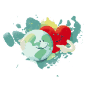
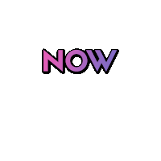
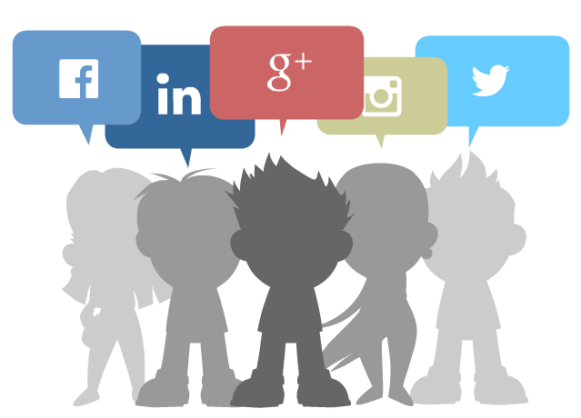

#  Hi, I'm Aristides Molina

####  Hello friend, it is a pleasure to meet you, I am a

- Computer Engineer 🖥️,
- Fullstack Software Developer 👨🏽‍💻, and
- Graphic designer 🎨

#####  I have developed many interesting projects at the Backend level 👨🏽‍💻 and at the Frontend level 🎨, and

### I am in search of new challenges and experiences to develop that do the world a better place

##  I'm currently on the lookout for new opportunities 💪

- I love Web design 👨‍🎨,
- Software Development 👨🏽‍💻,
- problem-solving 🧮 and
- much more 🎆

 

#### some of my programming languages or development platforms are:

- HTML5, 
- CSS3,
- Javascript,
- PHP,
- Angular,
- Bootstrap,
- MySQL,
- PostgreSQL,
- JQuery,
- Photoshop,
- Illustrator,
- AfterEffects,
- Among others ✨ ...
 

### You can know me a little more through my social networks :smile:

* My [Instagram](https://www.instagram.com/aristides_1000/) :+1: 
* My [Facebook](https://www.facebook.com/aristidesjose.molinaperez) :star:
* My [twitter](https://twitter.com/aristides_1000) :sparkles:
* My [linkedin](https://www.linkedin.com/in/aristides-jose-molina-perez-09b0579a/) :notes:

<!--
**aristides1000/aristides1000** is a ✨ _special_ ✨ repository because its `README.md` (this file) appears on your GitHub profile.

Here are some ideas to get you started:

- 🔭 I’m currently working on ...
- 🌱 I’m currently learning ...
- 👯 I’m looking to collaborate on ...
- 🤔 I’m looking for help with ...
- 💬 Ask me about ...
- 📫 How to reach me: ...
- 😄 Pronouns: ...
- ⚡ Fun fact: ...
-->
